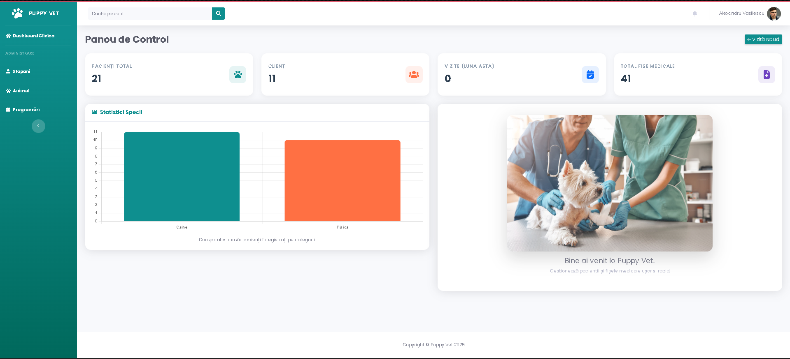
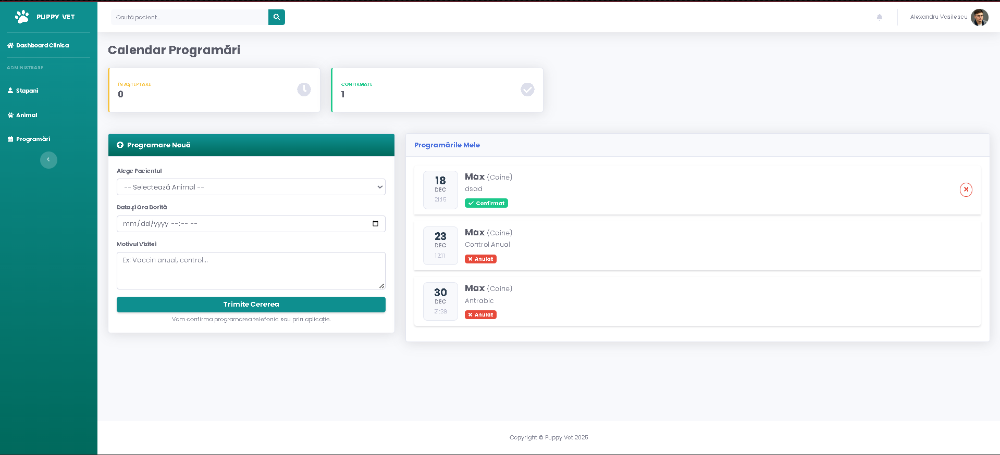
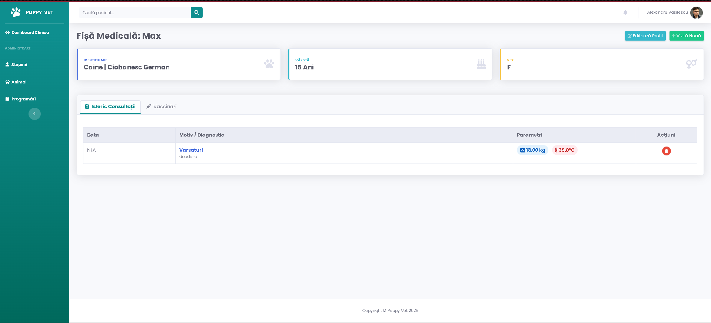

# 🐾 Puppy Vet - Veterinary Clinic Management System


**Puppy Vet** is a robust web application designed to digitize the workflow of a modern veterinary clinic. Built with **Python (Flask)** and **Microsoft SQL Server**, it serves as a complete solution for managing patients, medical history, appointments, and billing.

The application focuses on a seamless user experience for both veterinary staff and pet owners, featuring real-time notifications, secure authentication, and automated document generation.

---

## 📸 Application Gallery

### 1. Clinic Dashboard
*A comprehensive overview featuring real-time counters for patients, owners, and consultations, along with data visualization for species distribution.*


### 2. Appointment Management
*Staff can view pending requests. The system uses a visual workflow: Yellow (Pending), Green (Confirmed), and Red (Cancelled).*


### 4. Medical History & Invoicing
*Detailed tracking of every visit (Weight, Temp, Diagnosis) and automated PDF invoice generation for payments.*



---

## ✨ Key Features

### 🔐 Security & Authentication
* **Custom Auth System:** Secure registration and login using **Bcrypt** hashing.
* **Google OAuth Integration:** One-click login using Google accounts.
* **Password Recovery:** Full email-based flow for resetting forgotten passwords.
* **Session Security:** "Remember Me" functionality with secure, HTTP-only cookies.

### 🏥 Patient & Medical Management
* **Digital Health Cards:** Store consultation logs, diagnostics, treatments, weight, and temperature.
* **Vaccination Tracking:** Manage vaccine records and automatically calculate booster (Rapel) dates.
* **Owners Database:** Link multiple animals to a single owner profile.
* **Smart Search:** Quickly find patients by name or owner details.

### 📅 Advanced Appointment System
* **Request System:** Owners can request appointments via a dedicated form.
* **Notification Center:** Real-time bell notifications in the top bar for new pending requests and today's schedule.
* **Approval Workflow:** Admins/Doctors can **Confirm** or **Reject** appointments using interactive buttons.

### 💰 Financial Module
* **Payment Tracking:** Log payments and view financial history per client.
* **PDF Invoicing:** Automatic generation of professional PDF invoices using the `FPDF` library.

---

## 🛠️ Tech Stack

### Backend
* **Language:** Python 3.x
* **Framework:** Flask
* **Database:** Microsoft SQL Server (MSSQL)
* **ORM:** SQLAlchemy + PyODBC
* **Authentication:** Authlib (OAuth), Bcrypt
* **PDF Engine:** FPDF

### Frontend
* **UI Framework:** Bootstrap 4 (SB Admin 2 Theme)
* **Templating:** Jinja2
* **Scripting:** jQuery & Chart.js (for analytics)

---

## 🚀 Installation & Setup

Follow these steps to run the project locally:

### 1. Clone the repository
```bash
git clone [https://github.com/your-username/puppy-vet.git](https://github.com/your-username/puppy-vet.git)
cd puppy-vet
